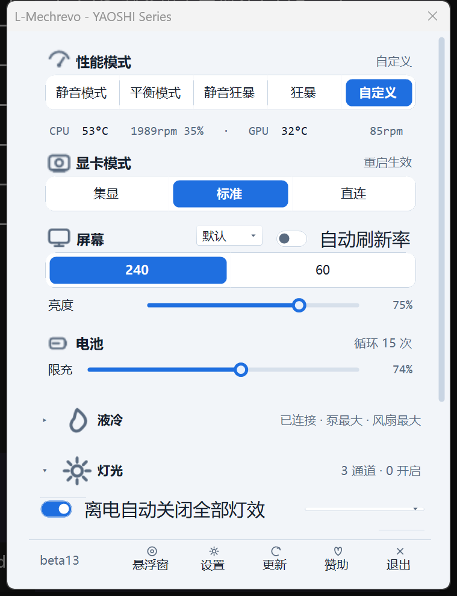
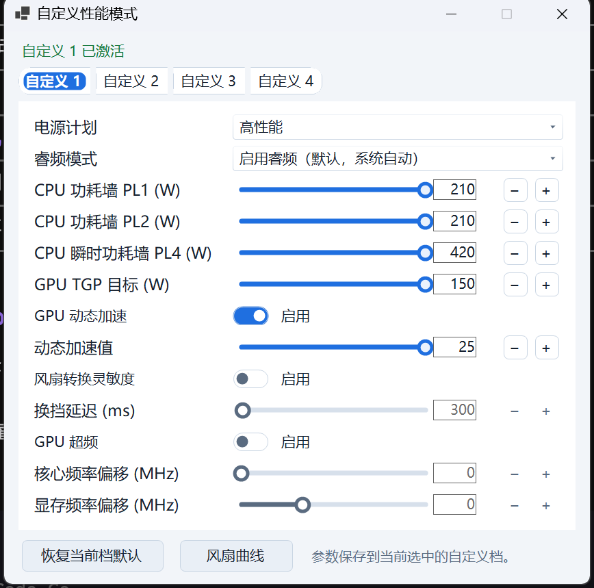
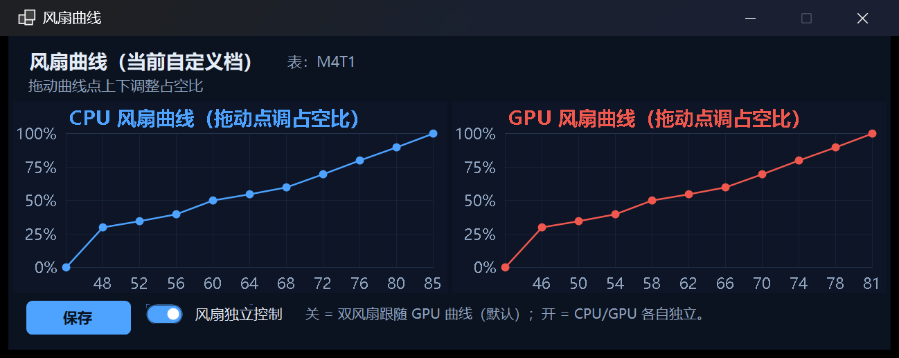
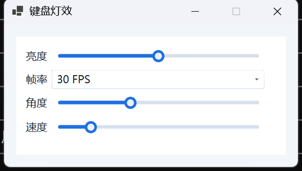
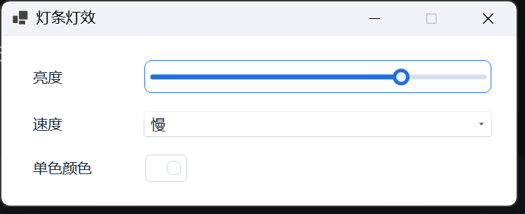
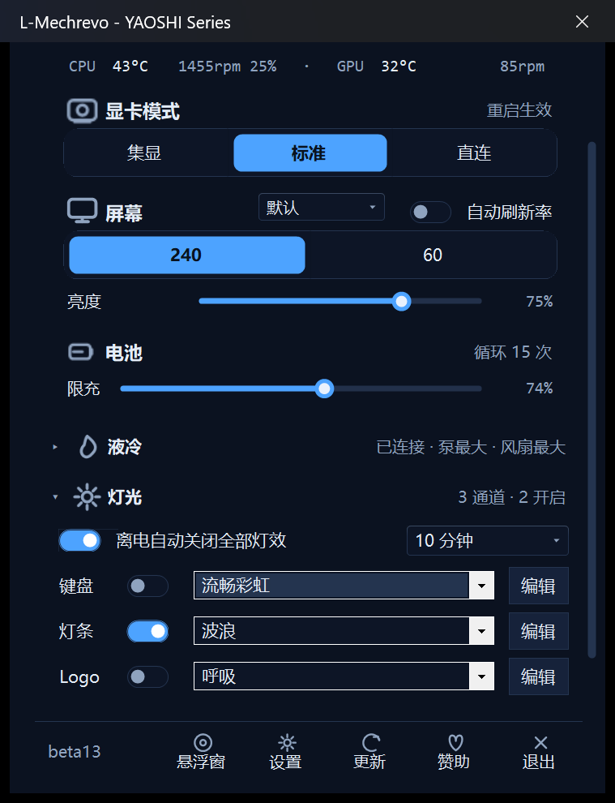
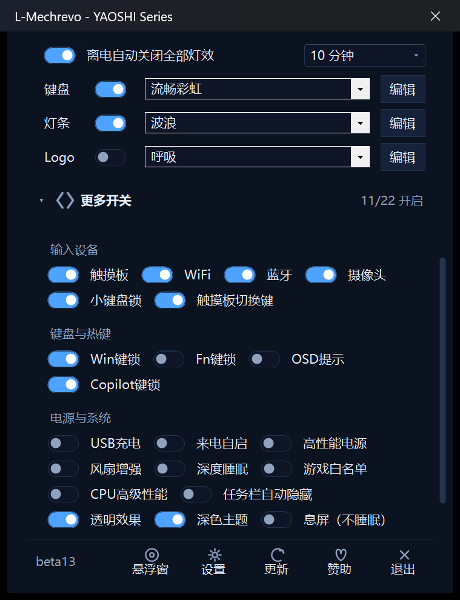
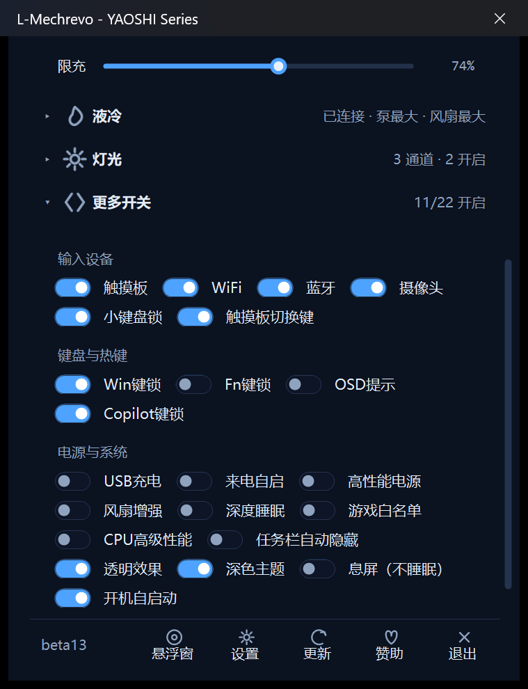
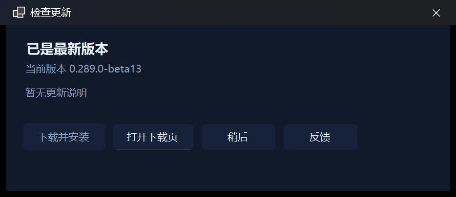

# L-Mechrevo

**中文** | [English](README.en.md)

L-Mechrevo 是一个面向机械革命（Mechrevo / Uniwill 代工）机型的开源控制台，运行在 Windows 托盘。它通过机器上已有的 GCU 硬件服务读取传感器状态并下发控制命令，把性能模式、自定义功耗、键盘灯效、屏幕与电池等常用控制收进一个轻量窗口；机型不支持的入口会自动隐藏。

## 界面总览

主界面是一块可滚动的仪表盘，从上到下依次是：性能模式、实时遥测、显卡模式、屏幕、电池、液冷系统、灯光、更多开关。底部工具条提供悬浮窗、设置、检查更新、赞助与退出。每个分组标题右侧的箭头可以折叠或展开该分组，折叠状态会被记住。

## 功能特性

### 性能模式

主界面「性能模式」分组提供分段按钮，点按即切换，当前档位高亮：

| 模式 | 说明 | 可用性 |
|---|---|---|
| 静音 | 限制功耗与风扇转速，噪音最低 | 全部机型 |
| 平衡 | 默认档，性能与噪音均衡 | 全部机型 |
| 静音狂暴 | 狂暴性能搭配更安静的风扇策略 | 仅在机型能力确认支持时显示，不支持的机器上自动隐藏 |
| 狂暴 | 解锁更高功耗墙 | 全部机型 |
| 自定义 | 打开自定义性能模式窗口 | 全部机型 |

托盘右键菜单同样可以切换性能模式，菜单项为「静音 (办公)」「平衡 (游戏)」「狂暴 (增强)」，当前档位带勾选标记。

### 自定义性能模式（4 个槽位）

在主界面点「自定义」打开独立窗口。窗口顶部有四个槽位按钮（自定义 1～4），各自保存一套完整参数，点选即切换整套参数，当前槽位会显示「自定义 N 已激活」。

每个槽位可设置：

- **电源计划**：Windows 电源计划下拉，按槽位独立保存与应用。
- **睿频模式**：禁用睿频 / 启用睿频 / 激进睿频 / 效率睿频，按槽位独立保存。
- **CPU 功耗墙 PL1 / PL2 / PL4**：滑条 + 数值框 + 步进按钮。PL1、PL2 是持续与短时功耗墙，PL4 是瞬时功耗墙；可选范围由 GCU 按机型回读。PL4 不是所有机型都上报，范围无效时该行自动隐藏。
- **GPU TGP 目标**：以瓦数限制显卡总功耗，范围按机型回读。
- **GPU 动态加速**：开关 + 动态加速值（W），对应 GPU Dynamic Boost。
- **风扇转换灵敏度**：开关 + 换挡延迟（ms），控制风扇转速档位切换的快慢。
- **GPU 超频**：开关 + 核心频率偏移（MHz）+ 显存频率偏移（MHz）。走 NVIDIA 驱动直连或 GCU 通道，任一可用时显示；可选范围由驱动实时回读。
- **恢复当前档默认**：一键把当前槽位的全部参数恢复默认。
- **风扇曲线**：打开曲线编辑器，见下节。

窗口底部提示「参数保存到当前选中的自定义档。」，改动即时写入当前选中的槽位。

#### 风扇曲线

在自定义模式窗口点「风扇曲线」打开编辑器。CPU 与 GPU 各一条曲线，横轴是温度（°C），纵轴是风扇占空比（%），共 16 个固定温度档，鼠标拖动曲线点即实时保存。窗口内可开「风扇独立控制」：关 = 双风扇跟随 GPU 曲线（默认），开 = CPU / GPU 各自独立。改完点「保存」。

### 灯光

主界面「灯光」分组按灯通道分行：键盘、灯条、Logo。每行有电源开关、效果下拉和「编辑」按钮：下拉直接切换效果，「编辑」打开对应窗口调参数。灯条与 Logo 两行只在机器带对应硬件时显示；分组标题右侧实时显示摘要（如「3 通道 · 1 开启」）。

- **键盘灯效**：10 种软件渲染效果：流畅彩虹、静态、呼吸、闪烁、按键反应、彩虹轮、闪电、火焰、雨滴、矩阵。每种效果带专属参数（亮度、帧率、角度、速度、颜色等，随效果不同而不同）。效果由程序内置渲染器逐帧写入键盘 HID，不依赖固件灯效。
- **灯条灯效**：单色、呼吸、波浪、冲击、流星，带亮度（4 档）、速度（慢 / 中 / 快）与单色颜色。
- **Logo 灯效**：单色、呼吸、混合，参数同灯条。

灯光分组顶部还有两个全局设置：

- **离电自动关闭全部灯效**：拔掉电源后自动熄灭所有灯，接回电源恢复。
- **睡眠时间**：关闭 / 10 秒（软件）/ 10 分钟～2 小时。空闲无输入达到设定时间后所有灯自动熄灭，检测到输入立即恢复。

### 液冷系统（外接水冷机）

连接外接水冷机后，「液冷系统」分组标题右侧显示连接状态摘要（如「已连接 · 泵最大 · 风扇最大」）。分组内可调：

- **泵速**：自动 / 45% / 60% / 最大。
- **风扇**：自动与多档手动。
- **水冷灯光**：打开液冷灯效菜单（水冷头 / 风扇灯效，依赖 Mk2 风扇灯能力）。

未连接时分组显示「未连接」，可尝试重新连接；GCU 通道不可用时支持蓝牙直连。整组只在检测到水冷机时显示。

### 屏幕

「屏幕」分组集中了屏幕相关控制：

- **刷新率**：按机型支持的频率列表生成分段按钮（如 240 / 60），点按即切换。
- **自动刷新率**：开关，开启后按负载自动在高刷新率与省电刷新率之间切换。
- **屏幕校色**：下拉，默认 / sRGB 两档色域切换。
- **亮度**：Windows 标准亮度滑条。
- **响应加速（Overdrive）**：在底部工具条「设置」弹窗中，机型支持时显示。

另有「息屏（不睡眠）」开关，位于「更多开关 → 电源与系统」：一次性压暗屏幕并顶住待机，动鼠标或键盘即恢复亮屏，系统不会进入睡眠。

### 显卡模式

「显卡模式」分组提供分段按钮：集显模式（节能）、标准模式、独显直连，部分机型还有自动等模式，按机型能力显示。切换独显直连、集显这类需要重启的模式时，程序会提示重启后生效。

### 电池

「电池」分组显示电池循环次数，并提供：

- **限充滑条**：连续滑条设置充电上限百分比（1% 步进），命令确认前滑条短暂禁用。
- **充满**：临时把充电上限恢复到 100%，适合出门前充满电。

### 更多开关

「更多开关」分组按三个子组收纳 22 个开关，标题右侧显示「N/22 开启」：

- **输入设备**：触摸板、触摸板切换键、WiFi、蓝牙、摄像头、小键盘锁。
- **键盘与热键**：Win键锁、Fn键锁、Copilot键锁、OSD提示。
- **电源与系统**：USB充电、来电自启、高性能电源、风扇增强、深度睡眠、游戏白名单、CPU高级性能、任务栏自动隐藏、透明效果、深色主题、息屏（不睡眠）、开机自启动。

每个开关点按即下发命令，命令确认前开关短暂禁用。深度睡眠改动需重启才生效，程序会弹窗提示。所有开关按机型能力显示：服务端没有上报对应字段的项整项隐藏，整组都没有可见项时连组标题一起收起。

### 其他

- **实时遥测**：性能模式下方的遥测行显示 CPU / GPU 温度、功耗、风扇转速与占空比。
- **悬浮窗**：桌面硬件悬浮窗，四种形态可点击切换，可直接拖动（底部工具条「悬浮窗」开关）。
- **日间 / 夜间主题**：底部工具条「设置」弹窗内切换。
- **官方控制台**：检测官方控制台是否在运行，可一键「隔离官方界面与托盘」，只保留 GCU 后台服务，随时可恢复。
- **程序内更新**：静默检测新版本，有新版时「检查更新」按钮出现角标；下载后自动校验 SHA-256 并拉起更新器。
- **开机自启动**：以用户级计划任务实现，不依赖管理员权限（「更多开关 → 电源与系统 → 开机自启动」）。

## 下载

在 [Releases](https://github.com/LiangyuLu-lly/L-Mechrevo/releases) 页面提供两种包：

- `L-Mechrevo-<版本>-setup.exe`：全新安装包，自带 .NET 运行时与 GCU 服务载荷，第一次使用下载这个。
- `L-Mechrevo-<版本>-unsigned.zip`：已有版本的自动更新包。程序内检测到新版会自动提示；也可以手动下载 zip，解压后自行替换程序文件。

## 系统要求

- Windows 10 / 11 64 位。
- 机械革命（Mechrevo / Uniwill 代工）机型。
- GCU 硬件服务（安装器会自动按显卡代际部署对应载荷）。
- 部分功能因机型硬件而异，不支持的入口会自动隐藏。

## 安装与首次使用

1. 从 Releases 下载 `L-Mechrevo-<版本>-setup.exe`。
2. 运行安装向导，按提示完成安装。
3. 安装器会自动检测显卡代际（40 系 / 50 系），部署对应的 GCU 服务载荷与驱动。
4. 安装完成后首次启动程序。
5. 如安装器提示需要重启，请重启一次再使用。
6. 程序常驻系统托盘，双击托盘图标打开主界面。
7. 如需开机自启，在主界面「更多开关 → 电源与系统」里打开「开机自启动」。

首次启动时程序会弹出引导窗口，介绍基本用法；如官方控制台正在运行，程序会提示可以隔离官方界面与托盘（不会卸载官方控制台，GCU 后台服务保留）。

## 使用说明

### 打开与关闭主界面

程序常驻托盘。双击托盘图标打开或收起主界面；点主窗口右上角的 × 只是收起，程序继续在托盘运行。要彻底退出，用底部工具条的「退出」按钮或托盘菜单。

### 切换性能模式

主界面性能面板点按分段按钮即切换，当前档位高亮。静音狂暴只在机型支持时出现。托盘右键菜单里也能切换，当前档位带勾选标记。

### 自定义模式槽位

点「自定义」打开自定义性能模式窗口，顶部选择自定义 1～4 槽位。每个槽位可设置电源计划、睿频模式、CPU 功耗墙（PL1 / PL2，部分机型还有 PL4）、GPU TGP 目标、GPU 动态加速、风扇转换灵敏度、GPU 超频，以及「风扇曲线」按钮。改完即保存到当前选中的槽位；点「恢复当前档默认」可还原当前槽位。

### 键盘灯效与灯带 Logo

主界面「灯光」组有三行：键盘、灯条、Logo。每行有电源开关、效果下拉和「编辑」按钮。下拉直接选效果，「编辑」打开对应窗口调参数（键盘灯效的亮度 / 帧率 / 角度 / 速度 / 颜色，灯条与 Logo 的亮度 / 速度 / 单色颜色）。灯光组顶部还有「离电自动关闭全部灯效」开关和「睡眠时间」下拉。灯条与 Logo 两行只在机器带对应硬件时显示。

### 液冷档位

「液冷系统」组标题右侧显示连接状态。连接后可调「泵速」（自动 / 45% / 60% / 最大）与「风扇」档位，「水冷灯光」按钮打开液冷灯效菜单。

### 屏幕刷新率与色域

「屏幕」行按机型支持的频率显示分段按钮，点按切换；行头右侧有「屏幕校色」下拉（默认 / sRGB）和「自动刷新率」开关。亮度滑条在同一行。

### GPU 模式

显卡面板点按分段按钮切换。切换独显直连 / 集显这类需要重启的模式时，程序会提示重启。

### 更多开关

「更多开关」卡片分三组：输入设备、键盘与热键、电源与系统。每项是一个开关，点按即下发命令，命令确认前开关会短暂禁用。深度睡眠改动需重启才生效，程序会弹窗提示。

### 程序内更新

程序启动后会静默检测新版本，有新版时「检查更新」按钮出现角标。点开更新窗口可查看更新说明，点「下载并安装」自动下载、校验并拉起更新器；网盘发布的版本点「打开下载页」手动下载。

## 常见问题

**提示 GCU 未连接怎么办？**
GCU 硬件服务尚未连接时，涉及硬件的命令会提示「GCU 硬件服务尚未连接，请稍后再试」。请确认官方控制台已安装、GCU 服务在运行，稍等片刻后重试。

**某些功能入口看不到？**
机型不支持的功能入口会自动隐藏，例如静音狂暴、灯带、Logo、PL4 功耗墙、水冷分组。这是按机型能力设计的，不是故障。

**没收到更新提示？**
更新检测需要当前版本已过期且网络可达。可以手动点底部工具条的「检查更新」，或到 Releases 页面下载。

**用了第三方远程 / 串流软件（如 UU远程）的「隐私屏」后本地屏幕变黑？**
这是远程软件隐私屏功能的正常行为，不是本程序故障。关闭远程端的隐私屏即可恢复。

**用了「息屏（不睡眠）」后屏幕黑了怎么恢复？**
动一下鼠标或键盘即可恢复亮屏。

**自定义功耗 / 超频有风险吗？**
有。功耗墙、超频、风扇曲线等操作可能影响稳定性与硬件寿命，请自行评估，风险自负。

**安装或更新时被驱动 / 杀毒软件拦截？**
安装器会部署 GCU 服务载荷与驱动，部分杀毒软件或系统策略可能拦截这类操作。请在杀软中放行安装器与程序目录后重试；被拦截的驱动未正确部署时，相关功能会不可用。

## 许可与对应源码

本程序包含派生自 [G-Helper](https://github.com/seerge/g-helper) 的代码（GPL-3.0-only），因此整体以 GNU GPL v3.0 授权发布。完整第三方声明见发布包内 `THIRD_PARTY_NOTICES.txt`。
依据 GPLv3 §6(b)：自本版本分发之日起三年内，任何第三方均可通过 liangyulu781@gmail.com 索取你所收到版本的完整、机器可读的对应源码（仅收取介质与传输成本）。索取时请注明确切版本号（如 `0.289.0-beta14`）。

## 反馈

欢迎在本仓库 [Issues](https://github.com/LiangyuLu-lly/L-Mechrevo/issues) 反馈问题。请附上：机型、程序版本号（主界面底部可见）、复现步骤。

## 免责声明

本项目为个人作品，与机械革命官方无关。功耗、超频类操作存在风险，请自行评估后果。本程序按"现状"提供，不提供任何担保。
